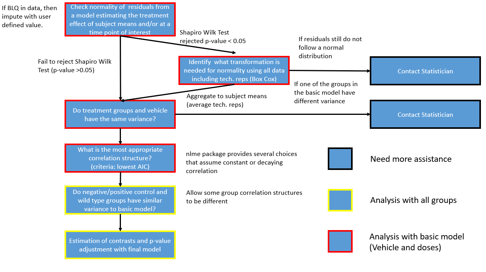

---
author: Treatment Evaluation Statistical Tool, TEST 1
output: 
  bookdown::word_document2:
    reference_docx: word_style.docx
    toc: yes
    number_sections: true
bibliography: bib.bib
biblio-style: apalike
link-citations: yes
date: "`r format(Sys.Date(), '%m/%d/%Y')`"
params:
  # uuid: '90aac960-b67b-4ec9-911f-d0963edfbeb1'
  uuid: '58c87f1c-0ff5-483c-b508-ff4aef0d0841' 

  title: 'No title provided'
title: "`r paste('Statistical Report for the Study Titled:', params$title)`"
---

```{r setup, include=FALSE}
#key: '6650608c-7988-4f2e-9da7-b46e41b64584-final' positive control and log transformation
#key: 'f031f88e-6d9a-4fca-a7ab-05d8aba6df8e-final' no transformation
#key: 'd24fad66-e6a3-4cf6-ba61-beae48eef1e1-final' saving user inputs (name, consulting statis, etc)
knitr::opts_chunk$set(echo = FALSE,
                      dpi = 300,
                      message = FALSE,
                      fig.show = 'asis',
                      fig.keep = 'high',
                      fig.width = 8,
                      #fig.height = 9,
                      fig.align='center',
                      fig.asp = 0.7)
library(test)
```

```{r grab-the-data,echo=FALSE,include=FALSE}
st <- storr_rds("storr")
# # Treatment
# con <- connect_table()
# sessions <- tbl(con, 'sessions') %>%
#   arrange(desc(timestamp)) %>%
#   head(1)
key <- paste0(params$uuid,'-final')
prismInputs <- paste0(params$uuid, '-prism')
print(params$uuid)
data <- st$get(key)
prismInputs <- st$get(
  prismInputs
)

trans_name <- transform_table() %>%
        filter(power == data$plot$data$box_cox) %>%
        select(transform_name) %>%
        unlist() %>%
        unname()

transform = data$tables$power != 1

groups_diff =  distinct(data$pre_modeling_input$transformed_data,Treatment,diff_group) %>% 
   filter(diff_group != 'Pooled') %>% 
   select(Treatment) %>% 
   unlist() %>%
   as.character()

if(length(groups_diff) > 2){
  groups_diff[length(groups_diff)] = paste('and', groups_diff[length(groups_diff)])
  groups_diff[1:(length(groups_diff)-1)] = paste0(groups_diff[1:(length(groups_diff)-1)], ',')
}

if(length(groups_diff) == 2){
  groups_diff[length(groups_diff)] = paste('and', groups_diff[length(groups_diff)])
}

toi = data$tables$tables$tab1$`Time Points`[!grepl('Average',data$tables$tables$tab1$`Time Points`)][1]
analysis_type = data$input_data$session_data$sessionMode
if(analysis_type == 'Exploratory'){
  time= data$inputs$timeTreatmentSelectorsTable
  }else{
    time = toi
}
var = data$pre_modeling_input$variable

model_transformed = final_model(transformed_data = data$plot$data$transformed_data, best = data$pre_modeling_input$best_model, variable = var)

model_original = final_model(transformed_data = data$plot$data$transformed_data, best = data$pre_modeling_input$best_model, variable = 'Response')


data_check = data$plot$data %>% cbind.data.frame(resid_transformed = residuals(model_transformed),
                                                 resid_orig = residuals(model_original))

assumption.cap = 'Histogram (top) and Q-Q plots (bottom) to assess the normality of the residuals'


scale = data$plot$ui_selections$y_axis

if(scale == 'transform' & data$plot$data$box_cox != 1){
  scale = 'Transformed Scale'
}


if(scale == "no_transform" | (scale == 'transform' & data$plot$data$box_cox == 1)){
  scale = 'Orignal Scale'
}

if(scale == "change_from_baseline"){
  scale = 'Change from Baseline'
}
```

# TEST Session Summary 

```{r test-session-summary, echo = FALSE, warning = FALSE, error = FALSE, message = FALSE}
session_info = data$input_data$session_data %>% 
  dplyr::select(-description ) %>%
  t %>% data.frame(col2 = .) %>% 
  tibble::rownames_to_column('col1') %>%
  mutate(col1 = gsub('_', ' ', col1),
         col1 = case_when(col1 == 'statistician' ~ 'Contact Statistician',
                         col1 == 'name' ~ 'Researcher',
                         col1 == 'sessionMode' ~ 'Objective Type',
                         !(col1 %in% c('statistician', 'name', 'sessionMode')) ~ col1),
         col1 = str_to_title(col1)) %>%
  filter(!(col1 %in% c('Uuid','Base Dir', 'Rel Path Home', 'Full Path Files', 'Studytitle')))

session_info %>% flextable() %>% 
  delete_part(part = "header") %>% 
  theme_box() %>% 
  width(width = 4) %>%
  fontsize(size = 8) %>%
  align(align = "center", part = "all")

plots_path = data$input_data$session_data$full_path_files

```

# Study Background and Objectives

`r data$input_data$session_data$description`

# Statistical Methods

## Overview 

In a typical study supported by TEST 1, data is collected over time, and the primary interest is to evaluate a treatment in multiple doses. The study typically includes two types of subjects, wild type and non-wild type, and several controls, such as vehicle, negative control, positive control and other comparators. We will denote the Wild Type animals as the Wild Type group and the non-Wild Type groups as vehicle, negative control, positive control, other comparators, and the treatments as doses. Based on the study design and known study objective, TEST 1 defines a set of group comparisons to be evaluated statistically.  

TEST 1 implements an algorithm that carries out a multiple-step analysis for statistical comparisons of groups.  The statistical comparisons are conducted through mixed effect repeated measure modeling. The algorithm is designed to automatically determine the best data transformation, check model assumptions (such as normality and homogeneous variance) and the appropriate correlation structure for the repeated measures (data across time points). In addition, the algorithm generates linear contrasts and carries out multiple testing adjustment for the pre-defined tests. 

Explanations of these key steps are described below, and the workflow of TEST 1 is described in Appendix A (section 6) along with a description of the statistical methods for scientific reporting purposes (Section 7, Appendix B).

## Basic Model

We define the basic model as a model that only considers the vehicle and treatment groups (groups of prime interest). These groups will be used to determine if a transformation is needed and which transformation is most appropriate. If the normality and homogeneous variance assumptions are not met in the basic model then further assistance is required and the consulting statistician will be contacted.

## Mixed Effects Modeling

Mixed effects models are employed to evaluate statistical differences between multiple experimental (treatment) groups across multiple times points. The model evaluates factors including treatment, time, and the interaction between treatment and time. In addition, the algorithm determines an appropriate correlation structure to account for the correlation between different time points. Some common correlation structures include auto-regressive (AR1) correlation structure which assumes that the correlation between time points decays at an exponential rate, compound symmetry (CS) correlation structure assumes that the correlation between time points is constant between any given two time points, and unstructured is the most flexible and has no constraints. 

Mixed effects models allow for the flexibility of computing variance/covariance structure for each group separately as needed. In other words, if a group has an extremely large or small variance than it can be computed independently from other groups avoiding, thus allowing for heteroskedasticity between the groups. The Akaike Information Criterion (AIC) is used to select the covariance structure that is most appropriate. The AR1 and CS correlations structures can allow for each time point to have different variance estiamtes and these structures are denoted ARH1 and CSH. The AIC strikes a balance between model complexity (number of parameters) and quality of the model fit (LRT). The candidate covariance structures are AR1 (ARH1), CS (CSH), Toeplitz (TOEP), and unstructured (UN) where the AR1 and CS are simplistic structures (only estimates one additional parameter) while UN correlation structure is the most complex (requires the estimation of $t*(t-1)/2$ additional parameters where $t$ is the number of time points). 

## Normality Assumption and Transformation

A Shapiro-Wilk (SW) test is conducted to determine if the residuals from a linear model with a treatment, time, and treatment and time interaction term are normally distributed. The SW test assumes that the residuals are normally distributed and looks for evidence for non-normality. If the SW test is rejected (there is enough evidence that the residuals do not follow a normal distribution, p-value < 0.05), then a Box-Cox transformation is conducted to suggest an appropriate transformation. Then the SW test is repeated on the residuals of the transformation to confirm that the residuals of the transformed data follow a normal distribution. If the SW test is rejected, then the algorithm will prompt researcher to consult a statistician as a transformation did not make data follow the normality assumption.

In experiments that have technical replication, all of the data will be used to check the normality assumption and subsequently determine the most appropriate Box-Cox transformation (treating technical replicates as independent). After this step, the technical replicates will be averaged at each time point for each subject. The resulting dataset will be used for all of the remaining analysis steps.

## Checking for Similar Variance between Groups

### Basic Model

For this application, we require that the variance for each of the groups in the basic model to be similar. To verify this assumption, first the variance is determined for each group and at each time point, and then averaged across the time points. Next, a likelihood ratio test (LRT) is conducted between a model that estimates one common variance and a model that estimates an individual variance for each group. In this case, LRT helps determines if a more complex model fits the data significantly better than a less complex model. Thus, a significant (p-value < 0.05) LRT provides evidence that it would be beneficial to model the variances of the groups separately. The variance between groups will be considered different if one the following two conditions are met:

1. If the p-value from the LRT is less than 0.05 (statistically significant) and the fold change between any group and the common variance is greater than 2, or

2. If the p-value from the LRT is greater than 0.05 (not statistically significant) and the fold change between any group and the common variance is greater than 3.

If the variance between groups are determined to be different, then no further analysis will be conducted and the consulting statistician will be contacted. Otherwise, the application will move forward to the next modeling step.

### Controls and Wild Type

Once the variance for groups within basic model is determined to be similar, then a similar procedure is followed as above. A LRT is conducted for a model that has one common variance and a model with a common variance for the groups in the basic model and a different variance for the controls and wild type. A similar set of criteria as above to determine if a group has a different variance than the basic model:

1. If the p-value from the LRT is less than 0.05 and the fold change between any group and the of the basic model is greater than 2, or

2. If the p-value from the LRT is greater than 0.05 and the fold change between any group and variance of the basic model is greater than 3.

If a group is determined to have a difference variance than the basic model then a estimation of the variance/covariance will be separate from the basic model. Otherwise, the application will move forward to fit the final mixed model with one single common variance component.


## Comparison between Experimental Groups and Multiple Comparisons

In this type of studies, there could be nine group comparisons:

```{r, echo = F, fig.cap='List of the 9 combinations of experimental groups and their interpretation.'}
contrasts =  data.frame(
    Label = LETTERS[1:9],
    Group_1 = c(
      "Wild Type",
      "Positive Control",
      "Wild Type",
      "Vehicle",
      "Wild Type",
      "Positive Control",
      "Each Dose",
      "Negative Control",
      "Negative Control"
    ),
    Group_2 = c(
      "Vehicle",
      "Vehicle",
      "Each Dose",
      "Each Dose",
      "Positive Control",
      "Each Dose",
      "Every Other Dose",
      "Vehicle",
      "Each Dose"
    ),
    `Purpose of Comparison` = c('Verify Disease Model.',
                    'Verify the experiment.',
                    'Can any doses reverse the disease?',
                    'Are any treatments effective?',
                    'Does Positive Control reverse disease?',
                    'Which doses are similar to Positive Control?',
                    'Do doses differ from each other?',
                    'Rule out matrix effect.',
                    'If H is rejected, then show Negative Control is not as good as treatment.'),
    `Multiple Testing Procedure` = c('NA','NA', 'None',"Dunnett",'NA','None','Mvt','NA','None'),
  check.names = FALSE) %>%
  mutate(Comparison = paste(Group_1, 'vs.', Group_2))

contrasts_display = contrasts %>%  select(Label, Comparison,`Purpose of Comparison`, `Multiple Testing Procedure`)

contrasts_ft <- flextable(contrasts_display) %>%
  add_footer_lines('Mvt refers to the simulation approach using values sampled from a multivariate t distriution.')
contrasts_ft <- width(contrasts_ft, width = c(0.75,3, 3, 1))
contrasts_ft = fontsize(contrasts_ft, size = 9, part = 'header')
contrasts_ft = fontsize(contrasts_ft, size = 8)
contrasts_ft
    
```

Multiple comparisons arise when a statistical analysis involves multiple simultaneous statistical tests, each of which has a potential to produce a discovery. A stated confidence level generally applies only to each test considered individually, but often it is desirable to have a confidence level for the whole family of simultaneous tests. Controlling the overall Type 1 error rate, as opposed to the Type 1 error rate of each individual test, allows us to avoid rejecting a comparison simply due to random error. 

For comparisons between doses, a simulation based method is used to determine the critical values and p-values based on sampling from the multivariate t distribution.[@Liu] [@berry] For comparisons between vehicle and doses, Dunnett's test will be employed which adjust p-values for comparisons between each treatment to a single control [@dunnett]. The comparison between wild type and doses, and positive control and doses are non-inferiority tests and thus the desired result is to fail to reject and these tests do not require multiple adjustment.  

<!-- For each one the comparison groups described above, linear contrasts are constructed to allow for simultaneous testing of the groups, as wells as testing the groups at the pre-selected time point and over time course average. To adjust for multiple comparison and preserve family wise Type I error rate, a simulation based method is used to determine the critical values and p-values based on sampling from the multivariate t distribution.[@Liu] [@berry]  -->

## Change from Baseline Analysis

The user will be allowed to select whether the raw/transformed values are to be analysed or to analysis the change of each observation from a subject's baseline measurement. The normality check and Box-Cox transformation will be conducted ignoring the baseline, then the change from baseline will be the response studied for the remainder of the analysis. 

## Software

TEST 1 was developed using the R statistical software [@Rbase]. The nlme::gls [@nlme] (this syntax means) [function library]::[specific function]) was used to construct the mixed effects models, and then the emmeans::emmeans function [@emmeans] was used to compute the group and pairwise comparison summary statistics, as well as, adjust the p-values for multiple comparisons. R Shiny [@shiny] was used to generate the web tool and this reported was generated using RMarkdown [@rmarkdown]. The interactive plots within the web application were generated using the  plotly::ggplotly function which converts a plot from ggplot2 [@ggplot2] to plotly [@plotly]. The prism-style plots were generated using the ggprism[@ggprism] package which is an extension to the ggplot2 package.
 
# Results

## Assumptions and Correlation Structure Results

```{r, include=F}
if(transform == 'TRUE'){
transform_result = paste('The residuals from a linear model were not normally distributed, thus', trans_name,' was applied to the data which was determined by a Box-Cox transformation.')
}else{
  transform_result = paste('The residuals from a linear model were normally distributed, thus no was applied to the data.')
}

correlation_result = paste(if_else(substr(data$pre_modeling_input$best_model,1,1) == 'A', 'An', 'A'), data$pre_modeling_input$best_model, 'lead to a model with the lowest AIC and thus was selected to model the correlation over time.')

variance_result = if_else(length(groups_diff) == 0, paste('All groups have similar variance, thus a common variance component is estimated for all groups'),
paste(paste(groups_diff, collapse = ''), 'had a different variance from the basic model, thus the variance', if_else(length(groups_diff) > 1, 'components', 'component'), 'of', paste(groups_diff, collapse = ''), 'were estimated separately.'))

```

`r transform_result`

`r correlation_result`

`r variance_result`

## `r ifelse(trans_name != "No transformation", "Graphical Summary of Residuals Before and After Transformation", "Graphical Summary of Residuals (No tranformation was needed")`

```{r, fig.cap=assumption.cap}

if(trans_name != "No transformation"){
new_trans = ifelse(grepl('An' ,trans_name), gsub('An ', "", trans_name),
                   gsub('A ', "", trans_name))

assumptions = ggarrange(plotlist = list(
   ggplot(data = data_check, aes(x = resid_orig)) + 
    geom_histogram(color = 'white') + theme_bw() + 
    ggtitle(paste('Histogram of the Residuals', data$plot$endpoint)) +
    theme(plot.title = element_text(size = 10)),
  ggplot(data = data_check, aes(x = resid_transformed)) + 
    geom_histogram(color = 'white') + theme_bw() + 
    ggtitle(paste('Histogram of the Residuals from', new_trans, data$plot$endpoint)) +
    theme(plot.title = element_text(size = 10)),
  ggplot(data = data_check, aes(sample = resid_orig)) + 
    stat_qq() + stat_qq_line() + theme_bw() + 
    ggtitle(paste('Q-Q plot from', data$plot$endpoint)) +
    xlab('Theoretical Quantiles') + ylab('Sample quantile') +
    theme(plot.title = element_text(size = 10)),
  ggplot(data = data_check, aes(sample = resid_transformed)) + 
    stat_qq() + stat_qq_line() + theme_bw() +  
    ggtitle(paste('Q-Q plot from', new_trans, data$plot$endpoint)) +
    xlab('Theoretical Quantiles') + ylab('Sample quantile') +
    theme(plot.title = element_text(size = 10)))
  )
}else{
  assumptions = ggarrange(plotlist = list(
   ggplot(data = data_check, aes(x = resid_orig)) + 
    geom_histogram(color = 'white') + theme_bw() + 
    ggtitle(paste('Histogram of the Residuals', data$plot$endpoint)) +
    theme(plot.title = element_text(size = 10)),
  ggplot(data = data_check, aes(sample = resid_orig)) + 
    stat_qq() + stat_qq_line() + theme_bw() + 
    ggtitle(paste('Q-Q plot from', data$plot$endpoint)) +
    xlab('Theoretical Quantiles') + ylab('Sample quantile') +
    theme(plot.title = element_text(size = 10))))
}

pngfile <- fs::path(knitr::fig_path(),  "assumptions.png")
ragg::agg_png(pngfile, width = 60, height = 36, units = "cm", res = 300, scaling = 2.5)
plot(assumptions)
invisible(dev.off())
knitr::include_graphics(pngfile)

```


## Plots 

```{r, echo = F, error=F, warning=FALSE}
pdata <- data$plot$data

test_plot_theme_word <- function(x) {
  
    theme(plot.title = element_text(size = 10),
        axis.title = element_text(size = 10),
        axis.text.x = element_text(angle = 45, vjust = 0.75, hjust = 0.75, size = 7),
        axis.text.y = element_text(size = 8),
        strip.text = element_text(size = 8),
        legend.text = element_text(size = 8),
        legend.title = element_text(size = 10),
        panel.grid.major = element_blank(),
        panel.grid.minor = element_blank())
}

# transformed_data = data$plot$data$transformed_data %>%
#   filter(Time %in% data$plot$ui_selections$time_sel,
#          Treatment %in% data$plot$ui_selections$trt_sel)

data$plot$ui_selection$trt_sel = data$plot$data$transformed_data$Treatment
data$plot$ui_selections$time_sel = data$plot$data$transformed_data$Time

plots = vizualization(transformed_data = pdata$transformed_data, power = data$plot$data$box_cox, endpoint = data$plot$endpoint, baseline = TRUE, transformation = TRUE, ui_sel = data$plot$ui_selections, palette = prismInputs$palette)

boxplot_caption = paste0("Box plot for each group and time.")

barplot_caption = paste0("Bar plot for each group and time.")


line_caption = paste0("Group level trajectory across time where the line corresponds to the group average of ", scale, '. The vertical bars are standard error bars for each group at each time point.')


trajectory_caption = paste0("Subject level trajectory across time where the line corresponds to the average of ", scale, " response in the presence of techinical replicates.")

prism_caption_box = paste0('Box plot of ', scale, ' response values at ', time, '. The stars above the horizontal bars correspond to the magnitude of the p-value comparing two groups where "\\*", "\\*\\*" , and "\\*\\*\\*" represent 0.01 <= p-value < 0.05, 0.001 <= p-value < 0.01, and p-value < 0.001, respectively. A p-value summary will only be shown for p-value less than 0.05.')
prism_caption_bar = paste0('Bar chart of ', scale, ' response values at ', time, '. The stars above the horizontal bars correspond to the magnitude of the p-value comparing two groups where "\\*", "\\*\\*" , and "\\*\\*\\*" represent 0.01 <= p-value < 0.05, 0.001 <= p-value < 0.01, and p-value < 0.001, respectively. A p-value summary will only be shown for p-value less than 0.05.')


```

```{r, echo=F, error=F, warning=FALSE, fig.cap=boxplot_caption}
plot1 = plots[[1]] + test_plot_theme_word()

pngfile <- fs::path(knitr::fig_path(),  "sub_line.png")
ragg::agg_png(pngfile, width = 60, height = 36, units = "cm", res = 300, scaling = 2.5)
plot(plot1)
invisible(dev.off())
knitr::include_graphics(pngfile)
```

```{r, echo=F, error=F, warning=FALSE,fig.cap = line_caption}
plot2 = plots[[2]] +
  test_plot_theme_word() +
    theme(legend.position = 'bottom') + 
  guides(color = guide_legend(nrow = 1))

pngfile <- fs::path(knitr::fig_path(),  "sub_line.png")
ragg::agg_png(pngfile, width = 60, height = 36, units = "cm", res = 300, scaling = 2.5)
plot(plot2)
invisible(dev.off())
knitr::include_graphics(pngfile)
```


```{r, echo=F, error=F, warning=FALSE,fig.cap=barplot_caption}
plot3 = plots[[3]] +
  test_plot_theme_word() +
    theme(
        legend.position = 'bottom') + 
  guides(colour = guide_legend(nrow = 1))

pngfile <- fs::path(knitr::fig_path(),  "sub_line.png")
ragg::agg_png(pngfile, width = 60, height = 36, units = "cm", res = 300, scaling = 2.5)
plot(plot3)
invisible(dev.off())
knitr::include_graphics(pngfile)
```


```{r, echo=F, error=F, warning=FALSE,fig.cap=trajectory_caption}

plot4 = plots[[4]] +
  test_plot_theme_word() +
    theme(
        legend.position = 'bottom')

pngfile <- fs::path(knitr::fig_path(),  "sub_line.png")
ragg::agg_png(pngfile, width = 60, height = 36, units = "cm", res = 300, scaling = 2.5)
plot(plot4)
invisible(dev.off())
knitr::include_graphics(pngfile)

```

<!-- \newpage -->

<!-- ```{r, echo = FALSE, error=F, warning=FALSE,fig.cap=prism_caption_bar, message=FALSE} -->
<!-- knitr::include_graphics(paste0(plots_path,'/prism_plots_bar.jpg')) -->
<!-- show_plot = "prism_plots_box.jpg" %in% list.files(plots_path) -->
<!-- ``` -->


<!-- ```{r, echo = FALSE, eval = show_plot ,error=F, warning=FALSE, fig.width=9, fig.height=6,fig.align='center', fig.cap=prism_caption_box, message=FALSE} -->

<!-- knitr::include_graphics(paste0(plots_path,'/prism_plots_box.png')) -->
<!---```--->

\newpage


```{r, echo = FALSE, error=F, warning=FALSE,fig.cap=prism_caption_bar, include = F}
transformed_data = data$plot$data$transformed_data
prismInputs$border = TRUE
prismInputs$fontsize = 30
prism = prism_plot(data = transformed_data, tables = data$tables$tables, 
                   trt_sel = levels(transformed_data$Treatment), 
                   time_sel =  time,
                   endpoint = data$plot$endpoint, format = 'word', 
                   cfb = data$input_data$changeFromBaseline, 
                   power = data$tables$power, 
                   num_groups = length(levels(transformed_data$Treatment)), 
                   type = 'bar', 
                   inputs=prismInputs) 

prism_box = prism_plot(data = transformed_data, tables = data$tables$tables, 
                   trt_sel = levels(transformed_data$Treatment), 
                   time_sel =  time,
                   endpoint = data$plot$endpoint, format = 'word', 
                   cfb = data$input_data$changeFromBaseline, 
                   power = data$tables$power, 
                   num_groups = length(levels(transformed_data$Treatment)), 
                   type = 'box', 
                   inputs=prismInputs) 
```


```{r, echo = FALSE, error=F, warning=FALSE,fig.cap=prism_caption_bar}
pngfile <- fs::path(knitr::fig_path(),  "bar.png")
ragg::agg_png(pngfile, width = 60, height = 36, units = "cm", res = 300, scaling = 2.5)
plot(prism)
invisible(dev.off())
knitr::include_graphics(pngfile)
```

```{r, echo = FALSE, error=F, warning=FALSE, fig.cap=prism_caption_box}
pngfile <- fs::path(knitr::fig_path(),  "box.png")
ragg::agg_png(pngfile, width = 60, height = 36, units = "cm", res = 300, scaling = 2.5)
plot(prism_box)
invisible(dev.off())
knitr::include_graphics(pngfile)
```

## Tables

```{r , echo=FALSE, error=F, warning=FALSE}
transform = data$tables$power != 1
show_text <- transform
footer <- if_else(!show_text,
        "No transformation was applied to the data. Difference and CI are estimated using model based LSmean",
        paste(trans_name, "transformation was applied to the data.  Mean and SE are estimated using model based LSmean")
      )

endpoint <- if_else(!show_text,
        data$plot$endpoint,
        paste(substr(x = trans_name, start = 3, stop = nchar(trans_name)), data$plot$endpoint)
      )
```

`r if(!show_text) {"\\begin{comment}"}`

### `r ifelse(show_text, paste('Table 1: Summary of', data$plot$endpoint),"")`

```{r conditional_block, eval=show_text,echo=FALSE, error=F, warning=FALSE}
tab0 = data$tables$tables$tab0 %>% filter(`Time Points` %in% time)
tab0_ft = word_tables(tab0, include_summ_stat = F, summary_only = T, transform = transform,
            footer = 'Group level summary on the original scale.', endpoint = data$plot$endpoint) %>%
  width(x = ., width = 1) 
FitFlextableToPage(tab0_ft)
```
`r if(!show_text) {"\\end{comment}"}`
\newpage
### `r paste(ifelse(show_text, 'Table 2: Comparison between Controls and Wild Type as to', 'Table 1 Comparison between Controls and Wild Type as to'),data$plot$endpoint)`

```{r, echo = F, error=F, warning=FALSE}
tab1 = data$tables$tables$tab1 %>% filter(`Time Points` %in% time)

tab1_ft = word_tables(data = tab1, include_summ_stat = T, summary_only = F, transform = transform,
            footer = footer, endpoint = data$plot$endpoint)  %>%
  width(x = ., width = 1) 
FitFlextableToPage(tab1_ft)

```
\newpage

### `r paste(ifelse(show_text, 'Table 3: Comparison among the Vehicle and Treatment Groups as to', 'Table 2: Comparison among the Vehicle and Treatment Groups as to'),data$plot$endpoint)`

```{r, echo = F, error=F, warning=FALSE}
tab2 = data$tables$tables$tab2 %>% filter(`Time Points` %in% time)

tab2_ft = word_tables(tab2, include_summ_stat = T, summary_only = F, transform = transform,
            footer = footer, endpoint = data$plot$endpoint)%>%
  width(x = ., width = 0.75) 

FitFlextableToPage(tab2_ft)
```
\newpage
### `r paste(ifelse(show_text, 'Table 4: Comparison Doses and Controls/Wild Type as to', 'Table 3: Comparison Doses and Controls/Wild Type as to'),data$plot$endpoint)`

```{r, echo = FALSE, error=F, warning=FALSE}
tab3 = data$tables$tables$tab3 %>% filter(`Time Points` %in% time)
#debug(word_tables)
tab3_ft = word_tables(tab3, include_summ_stat = T, summary_only = F, transform = transform,
            footer = footer, endpoint = data$plot$endpoint) %>%
  width(x = ., width = 1) 
FitFlextableToPage(tab3_ft)
```
\newpage
# References

<div id="refs"></div>

\newpage

# Appendix A: Workflow Illustration



# Appendix B: Statistical Methods for Scientific Publication

A 2-factor mixed effects model with interaction was used to predict `r data$plot$endpoint` with the treatment group and time. To check the normality assumption, a Shapiro-Wilk (SW) test was used on the residuals 2-factor linear model with interaction and if the SW is rejected then a Box-Cox transformation is applied to the data to determine an appropriate transformation. Lastly, another SW test is conducted to ensure that the residuals from the transformed data follow a normal distribution. The correlation structure for the repeated measures was selected by determining the model which led to the smallest the Akaike information criterion (AIC). The candidate correlation structures were autoregressive structure with lag 1 (AR1), heterogeneous AR1, compound symmetry (CS), heterogeneous CS, Toeplitz, and unstructured. To avoid putting too much emphasis on the control and wild type groups, only the groups of prime interest (treatment and vehicle groups) are used for the normality/transformation and correlation structure steps. To determine if groups have common variance a two-step procedure was used 1. Log likelihood was used to determine modeling the variances for each group explains the data more than modeling the data with one common variance 2. Compare the variance of each group to the average variance of the treatment and vehicle groups. This procedure is repeated for the treatment and vehicle groups, and then for all groups.  
